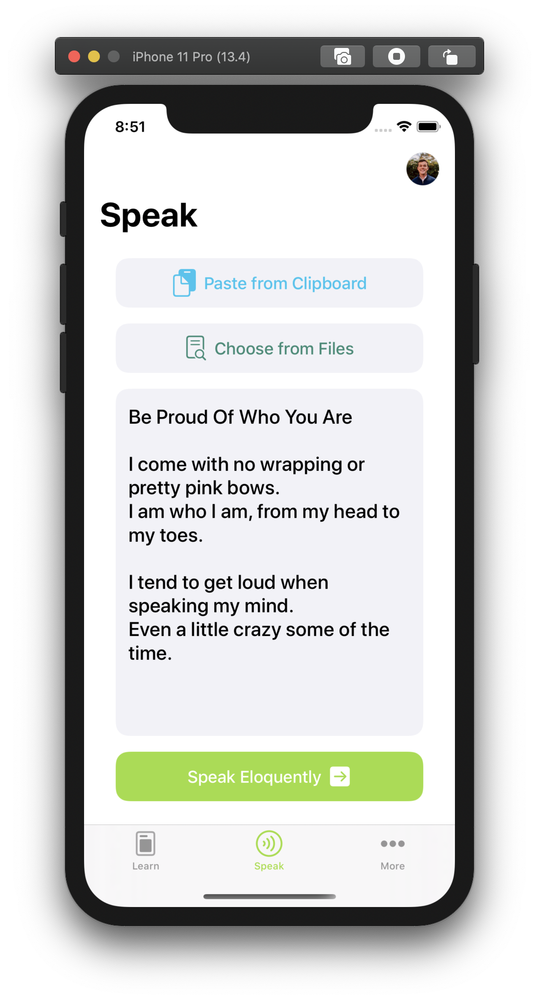

# TreeHacks 2020: Learn Out Loud with Eloquent on iOS
### TreeHacks 2020 // #hackwithtrees

### Speak to Learn. Learn to Speak.

The best way to learn something is to teach it to someone else, so we wanted to design an app that you could teach what you wanted to learn. Other apps such as Quizlet already allow users to statically and quietly study; Eloquent helps users to actively participate in their learning in the most engaging way possible as well as practice their speaking abilities.

      

  

## What It Does
#### Design new ways to learn content and improve speaking abilities for those of us with different learning styles.
Eloquent has two primary functions, both influenced by a connection between speaking and learning

The first is a public speaking coach, to help people practice their speeches. Users can import a speech or opt to ad-lib — the app will then listen to the user speak. When they finish, the app will present a variety of feedback: whether or not the user talked to fast, how many filler words they used, the informality of their language, etc. The user can take this feedback and continue to practice their speech, eventually perfecting it.

The second is a study tool, inspired by a philosophy that teaching promotes learning. Users can import Quizlet flashcard sets with a few taps — the app then uses those flashcards to prompt the user, asking them to explain a topic or idea from the set. The app listens to the user's response, and determines whether or not the answer was satisfactory. If it was, the user can move on to the next question; but if it wasn't, the app will ask clarifying questions, leading the user towards a more complete answer.

## How We Built It
#### Eloquent uses SoundHound's Houndify SDK, Apple's NaturalLanguage framework, and Kanna
The main technologies we used were Swift and Houndify. Swift, of course, was used to build our iOS app and code its logic. We used Houndify to transcribe the user's speech into text. We also took advantage of Houndify's "client matches" feature to improve accuracy when listening for keywords.

Much of our NLP analysis was custom-built in Swift, without a library. One feature that we used a library for, though, was keyword extraction. For this, we used a library called Reductio, which implements the TextRank algorithm in Swift. Actually, we used a fork of Reductio, since we had to make some small changes to the build-tools version of the library to make it compatible with our app.

Finally, we used a lightweight HTML Parsing and Searching library called Kanna to web-scrape Quizlet data.

## Challenges We Ran Into
#### New SDKs & Frameworks + one MacBook Pro + Natural Language
Charlie found it quite difficult to work on an iOS app, since he does not have a Mac. Coding in Swift without a Mac proved to be a challenge, since many powerful Swift libraries and tools are exclusive to Apple systems. This issue was partially alleviated by the decision to do most of the NLP analysis from the ground up, without an NLP library — in some cases though, coding without the ability to debug on my own machine was unavoidable.

Regarding Houndify, we ended up building some custom animations instead of using Houndify's built-in ones, but in the end, we solved all functionality issues with more and more code!
  

    

